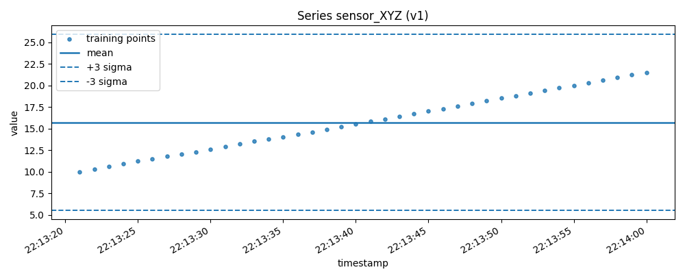
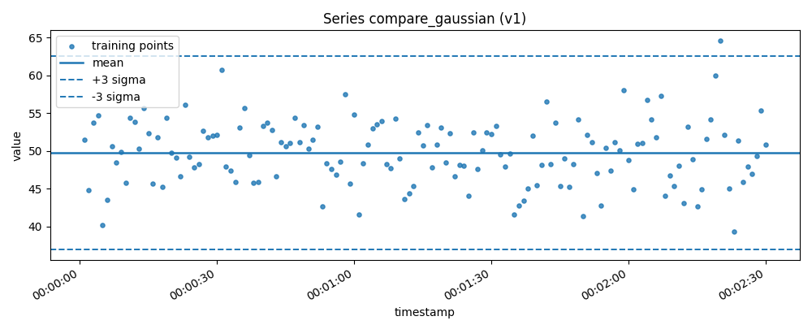
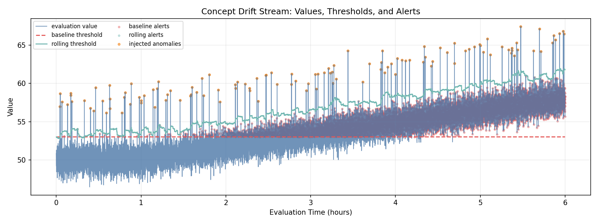
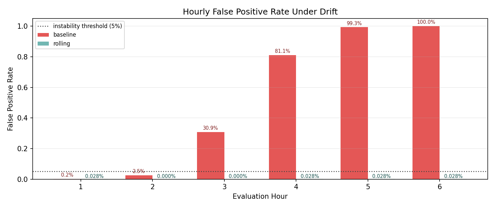

# time-series-anomaly-detection-api

A production-oriented REST API for univariate time-series anomaly detection, built with FastAPI.

The service:
- trains models per `series_id`
- versions each retrain (`v1`, `v2`, ...)
- persists model artifacts on local filesystem (`storage/`)
- serves real-time predictions
- exposes health metrics and visualization endpoints

## Architecture Overview

Each `series_id` keeps an independent model lineage. Retraining creates a new version without overwriting previous versions. Predictions default to latest version, but support explicit historical versions via `?version=`.
Detector selection is optional via `?detector=` (`gaussian` default, `isolation_forest` available).

Concurrent training is parallel across different `series_id` values and serialized for the same `series_id` using per-series locking.

For architecture decisions and trade-offs, see [Architecture](docs/project/ARCHITECTURE.md).

## Requirements

Runtime:
- Docker
- Docker Compose

Local development/test:
- Python 3.11+
- `venv` support (`python3-venv` on Debian/Ubuntu)

## Setup

```bash
git clone https://github.com/MarceloSanC/time-series-anomaly-detection-api.git
cd time-series-anomaly-detection-api
cp .env.example .env
docker compose up --build -d
curl http://localhost:8000/healthcheck
```

Verified from-scratch test flow (clone -> up -> test):

```bash
python3 -m venv .venv
source .venv/bin/activate
pip install -e ".[dev]"
pytest -v
```

Coverage quality gate:
- minimum enforced coverage: `80%` (`--cov-fail-under=80`)
- generate terminal + HTML report with:

```bash
make coverage
```

Optional container-only validation:

```bash
docker compose up --build -d
docker compose logs -f api
```

## Common Make Targets

| Target | Command | Description |
|---|---|---|
| `make install` | `pip install -e ".[dev]"` | Install all dependencies including dev tools |
| `make test` | `pytest -v` | Run full test suite with coverage gate |
| `make coverage` | `pytest --cov=app --cov-report=html` | Generate HTML coverage report at `htmlcov/index.html` |
| `make lint` | `ruff check app tests` | Run Ruff linter (rules E and F) |
| `make check` | `make lint && make test` | Pre-PR gate: lint then test |
| `make run` | `uvicorn app.main:app --reload` | Start local dev server on port 8000 |
| `make docker-up` | `docker compose up -d` | Start service in background |
| `make docker-down` | `docker compose down -v` | Stop service and remove volumes |
| `make docker-test` | `docker compose run --rm api-tests` | Run tests inside container |
| `make benchmark` | `python scripts/benchmark.py` | Run 100-request parallel inference benchmark |
| `make smoke` | `./scripts/manual/stage2_smoke_test.sh` | Manual smoke test against running service |

## Endpoint Examples

Train:

Script (detector default `gaussian`):

```bash
./scripts/examples/fit_request.sh
```

Script (detector explicito `isolation_forest`):

```bash
DETECTOR=isolation_forest ./scripts/examples/fit_request.sh
```

`curl` equivalente:

```bash
curl --fail-with-body -sS -X POST "http://localhost:8000/fit/sensor_XYZ" \
  -H "Content-Type: application/json" \
  --data-binary @- <<'JSON'
{
  "timestamps": [
    1700000001, 1700000002, 1700000003, 1700000004, 1700000005,
    1700000006, 1700000007, 1700000008, 1700000009, 1700000010,
    1700000011, 1700000012, 1700000013, 1700000014, 1700000015,
    1700000016, 1700000017, 1700000018, 1700000019, 1700000020,
    1700000021, 1700000022, 1700000023, 1700000024, 1700000025,
    1700000026, 1700000027, 1700000028, 1700000029, 1700000030
  ],
  "values": [
    10.0, 10.3, 10.6, 10.9, 11.2,
    11.5, 11.8, 12.0, 12.3, 12.6,
    12.9, 13.2, 13.5, 13.8, 14.0,
    14.3, 14.6, 14.9, 15.2, 15.5,
    15.8, 16.1, 16.4, 16.7, 17.0,
    17.3, 17.6, 17.9, 18.2, 18.5
  ]
}
JSON
```

Predict:

```bash
./scripts/examples/predict_request.sh
VERSION_QUERY=v1 ./scripts/examples/predict_request.sh
DETECTOR=isolation_forest ./scripts/examples/predict_request.sh
curl --fail-with-body -sS -X POST "http://localhost:8000/predict/sensor_XYZ?version=v1" \
  -H "Content-Type: application/json" \
  -d '{"timestamp":"1700000100","value":99.0}'
```

Healthcheck:

```bash
curl --fail-with-body -sS http://localhost:8000/healthcheck
```

Visualization:

```bash
curl "http://localhost:8000/plot?series_id=sensor_XYZ" --output plot.png
curl "http://localhost:8000/plot?series_id=sensor_XYZ&version=v1" --output plot_v1.png
```

Model introspection (additive extension):

```bash
# List tracked series (default tolerant mode)
curl --fail-with-body -sS "http://localhost:8000/models"

# Strict mode: fail-fast if any latest metadata is incomplete
curl --fail-with-body -sS "http://localhost:8000/models?strict=true"

# Detector-scoped list
curl --fail-with-body -sS "http://localhost:8000/models?detector=isolation_forest"

# Series detail with derived data_quality
curl --fail-with-body -sS "http://localhost:8000/models/sensor_XYZ"
curl --fail-with-body -sS "http://localhost:8000/models/sensor_XYZ?detector=isolation_forest"

# Version metadata summary (training_data excluded by default)
curl --fail-with-body -sS "http://localhost:8000/models/sensor_XYZ/versions/v1"
curl --fail-with-body -sS "http://localhost:8000/models/sensor_XYZ/versions/v1?detector=isolation_forest"

# Version metadata including persisted training_data
curl --fail-with-body -sS "http://localhost:8000/models/sensor_XYZ/versions/v1?include_data=true"
```

These `/models*` endpoints are additive introspection extensions and do not change
the core OpenAPI-defined contracts for `/fit`, `/predict`, and `/healthcheck`.

Example output:



The image shows training points (scatter), the model mean, and upper/lower 3-sigma thresholds.

## Analysis Scripts

Three standalone scripts cover latency benchmarking, detector quality comparison, and concept drift analysis. All output JSON artifacts to `scripts/` and require the service running at `http://localhost:8000`.

---

### Benchmark — inference latency under parallel load

Measures p50/p95/p99 latency and throughput under 100 concurrent prediction requests.

```bash
make benchmark                                        # gaussian default
python scripts/benchmark.py --detector isolation_forest
python scripts/benchmark.py --both-detectors          # saves combined JSON
```

Output saved to `scripts/benchmark_results.json`.

Latest recorded run (`--both-detectors`):

| Metric | Gaussian | Isolation Forest |
|---|---:|---:|
| p50 (ms) | 291.53 | 249.64 |
| p95 (ms) | 368.95 | 322.59 |
| p99 (ms) | 369.96 | 325.16 |
| avg (ms) | 262.30 | 232.33 |
| min (ms) | 35.77 | 21.87 |
| max (ms) | 370.31 | 327.79 |
| throughput (req/s) | 250.80 | 292.95 |
| total duration (s) | 0.40 | 0.34 |

- `isolation_forest` was faster across all percentiles in this run (+42 req/s, ~+17% throughput).
- Results are environment-sensitive; compare trends across repeated runs rather than absolute values.

---

### Detector Comparison — detection quality on synthetic anomalies

Trains both detectors via the API on the same gaussian-distributed dataset (150 points, mean=50, std=5), then evaluates on a held-out test split with 20 positive spike anomalies injected at mean+4.5*std. Models are persisted after the run.

```bash
.venv/bin/python scripts/compare_detectors.py
```

Output saved to `scripts/detector_comparison.json`. After the run, the gaussian training data can be visualized:

```bash
curl "http://localhost:8000/plot?series_id=compare_gaussian" --output compare_plot.png
```



Latest recorded run:

| Metric | Gaussian | Isolation Forest |
|---|---:|---:|
| TPR | 100.00% | 100.00% |
| FPR | 0.00% | 17.50% |
| p50 latency (ms) | 3.80 | 31.98 |
| p95 latency (ms) | 7.20 | 38.86 |
| p99 latency (ms) | 9.04 | 81.89 |

- Both detectors achieved 100% TPR on anomalies injected at mean+4.5*std.
- Gaussian achieved 0% FPR; IsolationForest flagged 17.5% of normal points (higher FPR by design of its 10th-percentile threshold).
- This result is expected on gaussian-distributed data — the gaussian detector is a parametric fit to the exact distribution. IsolationForest holds the advantage on non-gaussian, multimodal, or clustered-anomaly scenarios, and is the only option for detecting negative outliers.
- Latency includes HTTP round-trip and is comparable between detectors, not a measure of pure algorithmic cost.

---

### Drift Analysis — concept drift behavior over time

Simulates 6 hours of sensor data with gradual mean drift starting at hour 1, and compares a static threshold (trained on healthy baseline) against a rolling-window adaptive threshold.

```bash
.venv/bin/python scripts/drift_analysis.py
```

Output saved to `scripts/drift_analysis_results.json`. Three plots are generated under `docs/assets/`.





Latest recorded run:

| Metric | Static Baseline | Rolling Window |
|---|---:|---:|
| FPR (overall) | 52.32% | 0.019% |
| Alerts/hour | 1892.8 | 20.3 |
| Time to instability | 3h | — (stable) |

- The static threshold becomes unreliable after drift begins (~hour 1), saturating at 52% FPR by hour 3.
- The rolling window adapts continuously, keeping FPR near zero throughout the drift window.
- FPR reduction: ~280,875× relative to static baseline.

## Known Limitations

- The baseline algorithm detects only positive anomalies (`value > mean + 3*std`).
- Negative outliers are not flagged by design. Example: if `mean=100` and `std=5`, a value of `50`
  (i.e. `mean - 10*std`) still returns `anomaly=false` in `/predict`.
- Metrics are in-memory and reset on service restart.
- Persistence is local filesystem (`storage/`), suitable for single-instance deployments.
- `/plot` requires metadata that includes `training_data`; legacy models without it return `422 PLOT_DATA_UNAVAILABLE`.

## Troubleshooting

**`/plot` returns `422 PLOT_DATA_UNAVAILABLE`**

The plot endpoint requires `training_data` to be persisted in `metadata.json`. Models trained before this field was added do not have it. Retrain the series to generate a compatible artifact:

```bash
curl -X POST "http://localhost:8000/fit/sensor_XYZ" -H "Content-Type: application/json" -d '{"timestamps":[...],"values":[...]}'
```

**`POST /fit` returns a `400` validation error**

Common validation error codes and their causes:

| Error code | Cause |
|---|---|
| `INSUFFICIENT_DATA` | Fewer than `MIN_DATA_POINTS` points (default: 30) |
| `CONSTANT_SERIES` | Series standard deviation is below `STD_THRESHOLD` |
| `DUPLICATE_TIMESTAMPS` | Two or more points share the same timestamp |
| `UNORDERED_TIMESTAMPS` | Timestamps are not strictly increasing |
| `INVALID_VALUES` | Series contains `NaN` or infinite values |
| `FLAT_LINE_DETECTED` | Trailing window is constant (only when `FLAT_LINE_ENABLED=true`) |
| `TEMPORAL_GAP_DETECTED` | Max interval exceeds `MAX_TEMPORAL_GAP_FACTOR × median interval` (only when `TEMPORAL_GAP_ENABLED=true`) |

**Quick Docker validation**

```bash
# Start and verify the service is healthy
make docker-up
curl http://localhost:8000/healthcheck

# Run containerized test suite
make docker-test

# Inspect logs
docker compose logs -f api

# Tear down
make docker-down
```

## Training Validation Extensions

- Flat-line and temporal-gap rules are opt-in via config and disabled by default.
- Thresholds are configurable via `FLAT_LINE_WINDOW` and `MAX_TEMPORAL_GAP_FACTOR`.
- Enable flags are configured with `FLAT_LINE_ENABLED` and `TEMPORAL_GAP_ENABLED`.

## Architecture Decisions (Brief)

- Persistence uses detector-scoped local filesystem artifacts (`joblib` + `metadata.json`) under `storage/{series_id}/{detector}/{version}`.
- Concurrency uses per-series locks (`threading.Lock`) to serialize retraining of the same `series_id`.
- Validation is fail-fast and runs before training lock acquisition.
- API contract follows `docs/context/openapi_spec.yaml`; internal schemas are mapped in the API layer.
- Metrics are in-memory with bounded latency windows for percentile calculations.
- Live API docs expose detector query params and normalized errors at `/docs` and `/redoc`.

## Configuration

Copy `.env.example` to `.env` and adjust as needed.
`.env.example` is a documented baseline with safe defaults for local execution and Docker.
Use `.env` for real runtime values and keep it untracked.

| Variable | Default | Description |
|---|---|---|
| `APP_PORT` | `8000` | API server port |
| `STORAGE_PATH` | `./storage` | Model artifact directory |
| `MIN_DATA_POINTS` | `30` | Minimum points required for training |
| `STD_THRESHOLD` | `1e-10` | Minimum std threshold for constant-series rejection |
| `MAX_LATENCY_SAMPLES` | `1000` | Sliding window size for latency percentiles |

## Structured Logging

The service supports two log output formats, controlled by the `LOG_FORMAT` environment variable.

| Value | Behaviour |
|---|---|
| `text` (default) | Human-readable lines — `timestamp [request_id] LEVEL logger: message` |
| `json` | One JSON object per line, suitable for log aggregation platforms (Datadog, Loki, CloudWatch) |

Switch format at startup:

```bash
# local development (text, default)
LOG_FORMAT=text make run

# structured JSON output
LOG_FORMAT=json .venv/bin/uvicorn app.main:app --host 0.0.0.0 --port 8000
```

Sample JSON log line emitted after a training request:

```json
{
  "timestamp": "2026-04-15 18:00:00,123",
  "level": "INFO",
  "logger": "app.services.model_service",
  "message": "Training completed",
  "request_id": "4a3f1b2e-...",
  "event": "model_trained",
  "series_id": "sensor_XYZ",
  "detector": "gaussian",
  "version": "v1",
  "n_samples": 150,
  "duration_ms": 4.21,
  "mean": 50.03,
  "std": 4.97
}
```

Recommended fields for filtering in external log platforms:

| Field | Use case |
|---|---|
| `event` | Filter by operation type (`model_trained`, `prediction_served`) |
| `series_id` | Trace all activity for a specific sensor/series |
| `request_id` | Correlate all log lines for a single HTTP request |
| `is_anomaly` | Alert on prediction decisions |
| `detector` | Segment metrics by detector family |
| `version` | Identify which model version served a prediction |

Request-scoped summary logging checklist:

- `/fit`: log `event=model_trained` with `series_id`, `detector`, `version`, `n_samples`, `duration_ms`, and gaussian params (`mean`, `std`) when applicable.
- `/predict`: log `event=prediction_served` with `series_id`, `detector`, `version`, `value`, `is_anomaly`, and detector-specific decision fields (gaussian: `mean`, `upper_bound`; isolation_forest: `score_threshold`).
- `/plot`: include `series_id`, resolved `version`, and outcome (`success` or `PLOT_DATA_UNAVAILABLE`) with request correlation.
- `/models*`: include query context (`strict`, `detector`, `include_data`) and returned series/version scope for traceability.

## Documentation

- [Docs Index](docs/README.md)
- [Roadmap](docs/project/ROADMAP.md)
- [Architecture](docs/project/ARCHITECTURE.md)
- [Modeling Notes](docs/project/MODEL_DESIGN_NOTES.md)
- [AI Usage](docs/ai/LLM_USAGE.md)
- [Git Protocol](docs/process/GIT_PROTOCOL.md)
- API live docs: `/docs` (Swagger UI) e `/redoc` (ReDoc)
