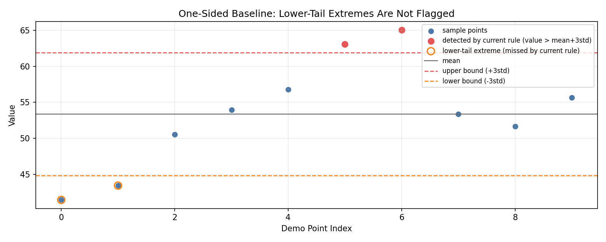

# MODELING_NOTES — Baseline Analysis and Evolution Path

## 1. Baseline Model Analysis

Current detector: `AnomalyDetectionModel` using a global threshold:

- train: `mean = np.mean(values)` and `std = np.std(values)`
- infer: anomaly when `value > mean + 3 * std`

### One-sided detection

The current rule only flags upper-tail events. Lower-tail events (`value < mean - 3*std`) are always labeled as non-anomalous.

Industrial implication:
- in rotating machinery, both spikes and drops can indicate faults
- a sudden amplitude drop can indicate sensor issues, coupling problems, or mechanical seizure states

Conclusion:
- the current detector is asymmetric by design and will miss a class of relevant anomalies.

Illustration:

### Sensitivity to training outliers

`mean` and `std` are non-robust estimators. A single large spike in training data can inflate `std`, widening thresholds and reducing detector sensitivity.

Industrial implication:
- noisy acquisition and transient interference are common
- a contaminated training window can make the detector under-sensitive for long periods

Robust alternative:
- median center with MAD scale (`median ± k * MAD`) for better resistance to extreme points.

### Stationarity assumption

The detector assumes constant distribution over time (fixed mean and variance).

Industrial implication:
- asset behavior drifts with wear, maintenance cycles, operational load, and environmental conditions
- fixed thresholds can produce increasing false positives or false negatives as operating regime changes

Conclusion:
- baseline is reliable only when the process is approximately stationary over the model lifetime.

### No contextual anomaly detection

The detector evaluates only one scalar value with one global threshold and no operating context.

Industrial implication:
- the same value may be normal under one regime and anomalous under another
- without regime context, alert quality degrades in mixed operating conditions

### No concept-drift adaptation

Once trained, thresholds remain static until explicit retraining.

Industrial implication:
- real-world systems require periodic adaptation and/or drift-triggered retraining
- static models accumulate mismatch between learned distribution and live stream

---

## 2. When the Baseline Is Appropriate

Despite limitations, this baseline is a valid engineering choice in specific scenarios:

1. Small training sets (`< 500` points), where simple estimators reduce overfitting risk.
2. High interpretability requirements for maintenance operators.
3. Strict latency budgets, since algorithmic inference is O(1) (while end-to-end latency still depends on serving-path I/O/model loading strategy).
4. Single-channel signals with limited non-stationarity.
5. Early-stage deployment where fast iteration and observability matter more than model complexity.

Practical reading:
- baseline is ideal as an operational starting point
- it should be treated as a monitored baseline, not a final detector for all assets.

---

## 3. Alternatives by Failure Mode

| Limitation | Alternative | Why | Complexity |
|---|---|---|---|
| Outlier-sensitive training stats | Median ± 3×MAD | Robust to training spikes and heavy tails | Low (drop-in math) |
| One-sided rule | Symmetric threshold (`abs(value-mean) > 3*std`) | Captures both tails | Low |
| Slow non-stationarity | Rolling mean/std | Adapts thresholds over time | Medium |
| Regime/context dependence | Isolation Forest with feature context | Non-parametric and context-aware | Medium |
| Temporal pattern anomalies | LSTM/TCN autoencoder | Captures sequence structure | High |
| Drift over long horizons | ADWIN / Page-Hinkley | Drift-aware retraining trigger | Medium |

Selection strategy:
- prefer lowest-complexity alternative that addresses the dominant observed failure mode in production data.

---

## 4. Concept Drift Analysis (Empirical)

This section uses real outputs generated by `scripts/drift_analysis.py`.

### Experimental setup

- Training data: `7,200` points (2 hours at 1 Hz), stationary regime
- Evaluation data: `21,600` points (6 hours at 1 Hz), drift begins at hour 1
- Drift profile: linear shift of `+8.0` units over 5 hours (hour 1 to hour 6)
- Injected anomalies: `0.5%` probability, `+8.0` units magnitude
- Baseline detector: global `mean + 3*std` trained on healthy data
- Rolling detector: causal window of `300` points, `mean + 3*std` per window
- Instability threshold: hourly-window `FPR > 5%`
- Reproducible with:
  - `.venv/bin/python scripts/drift_analysis.py --seed 42 --plot`
  - `python scripts/drift_analysis.py --seed 42 --plot`

### Results

- Baseline FPR: `52.32%` — majority of non-anomalous points flagged as anomalies
- Rolling FPR: `0.0186%` — detector remains stable throughout the drift window
- Relative magnitude: baseline generates `~2809x` more false positives than rolling
- Baseline becomes operationally unreliable at hour `3` of the evaluation window (hourly FPR exceeds 5% threshold)
- Rolling detector did not cross the `5%` instability threshold during the 6-hour evaluation

Supporting operational metrics:
- Baseline alerts/hour: `1892.83`
- Rolling alerts/hour: `20.33`
- Baseline threshold stability (std): `0.0` (fixed threshold)
- Rolling threshold stability (std): `2.6009` (adaptive threshold)

### Visual evidence

**Figure 1 — Evaluation stream with baseline vs rolling thresholds and alert points**

**Figure 2 — Hourly false positive rate (baseline vs rolling) with instability line**

### Interpretation

- Threshold drift impact: the fixed baseline threshold quickly becomes misaligned with the shifted distribution, inflating false positives as drift accumulates.
- Operational effect (alert fatigue vs missed events): baseline alert volume (`~1893/hour`) is operationally noisy for a 1 Hz stream, while the rolling detector remains low-noise (`~20/hour`) under the same drift profile.
- Recommendation for retraining cadence or drift trigger: treat baseline as unstable once windowed FPR exceeds `5%` (observed at `~3h` in this setup). In production, use this as a retraining/rollback trigger and prefer adaptive thresholds when drift is expected.
- For rotating equipment monitored at 1 Hz, this instability window maps to roughly `10,800` sensor readings before alert fatigue becomes critical under a fixed-threshold baseline.

---

## 5. System Evolution for Multi-Detector Support

Current versioning key is `(series_id, version)`.

For production evolution, extend to `(series_id, detector_type, version)` to support:
- fast online detector for low-latency alerts
- robust batch detector for nightly validation/correlation

### Proposed storage layout

`storage/{series_id}/{detector_type}/{version}/`

### Proposed index evolution

Add detector dimension in index metadata, e.g.:
- `latest_version` per detector
- version lists per detector family

### Proposed API extension

Add optional query parameter:
- `?detector=baseline|isolation_forest|...`

Usage:
- `?detector=` selects detector family
- `?version=` selects version inside detector family

### Benefits

1. Enables side-by-side detector validation on same asset.
2. Supports progressive rollout by detector type.
3. Preserves traceability of alerts to exact model family/version.

---

## Notes for Reviewers

This document intentionally separates:
- what the current baseline does well (simplicity, interpretability, latency)
- where it fails in industrial non-stationary environments
- how to evolve model strategy without overengineering the current MVP.
